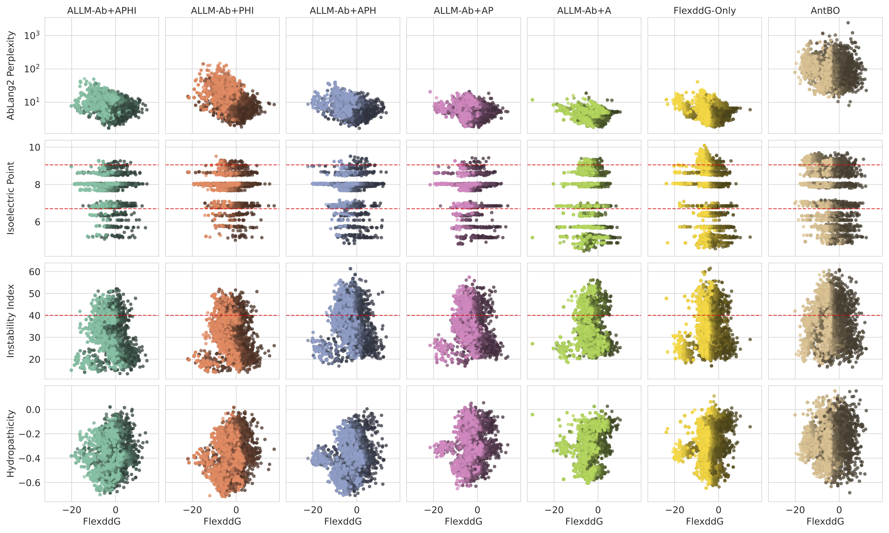

# ALLM-Ab: Active Learning-Driven Antibody Optimization Using Fine-tuned Protein Language Models




This repository contains the code for ALLM-Ab, a multi-objective antibody optimization framework using protein language models.

1. **allmab_offline**: Evaluation of active learning in offline settings using BindingGYM dataset
2. **allmab_online**: Implementation of active learning in online settings using Flex ddG

## Setup

### Installation

The easiest way is to install the dependencies listed in `pyproject.toml` using uv.

```bash
git clone https://github.com/your-username/ALLM-Ab.git
cd ALLM-Ab
uv sync
```

Optional: [Flex ddG](https://github.com/Kortemme-Lab/flex_ddG_tutorial) installation is required for the allmab_online component.

### Data

The datasets can be obtained from BindingGYM:
```bash
git clone https://github.com/luwei0917/BindingGYM
```

## Usage

### allmab_offline

Example:
```bash
python al_run.py exps/outputs_ablang/0/greedy_0.0/dms_0_N-50_ini-1/config.yaml
```

### allmab_online

Example:
```bash
cd allmab_online
python al_run.py configs/5A12_dual/ablang2/greedy_dual.yaml
```

#### Filling Mode[TODO]

A filling mode that supports general online active learning processes is available as follows.
```bash
cd allmab_online
python al_run_filling.py sample.yaml
```

## Project Structure

- **allmab_offline**: Offline environment for protein binding simulation
- **allmab_online**: Online analysis using Flex ddG
- **notebooks**: Jupyter notebooks for analysis
  - **reproduction_bindinggym.ipynb**: Notebook for reproducing bindinggym results
  - **reproduction_flexddg.ipynb**: Notebook for reproducing flexddg results
  - **analysis**: Analysis notebooks
- **results**: Results from experiments
  - **allmab_offline**: Results from allmab_offline
  - **allmab_online**: Results from allmab_online

## Citation

Furui K, Ohue M. ALLM-Ab: Active Learning-Driven Antibody Optimization Using Fine-Tuned Protein Language Models. _Journal of Chemical Information and Modeling_, Article ASAP, 2025. https://doi.org/10.1021/acs.jcim.5c01577
